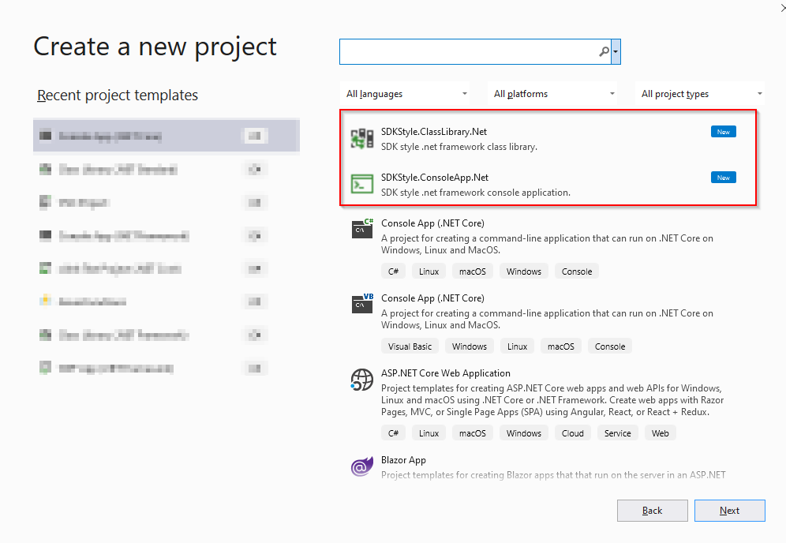

# SDKStyle.Templates.Net
SDK style C# project templates for .net framework projects.

If you are using .net framework projects and want to use [new sdk style csproj](https://docs.microsoft.com/en-us/nuget/resources/check-project-format) templates this is the extension you can use on your visual studio.

After installing from market place, the project templates will appear on your visual studio new project dialog.
